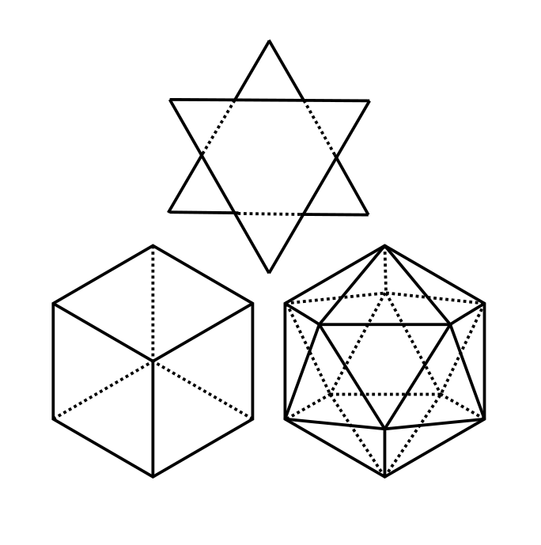

# 杉村 潤輝（すぎむら じゅんき） 

## 所属
京都大学大学院 工学研究科 分子工学専攻 (現: 化学理工学専攻) 分子材料科学講座 量子分子科学分野  
博士2年  
次世代研究研究者挑戦的研究プログラム（SPRING）採択者

## 目次
- [自己紹介](aboutme.html)  
- [研究内容](research_contents.html)  
- [Tips](tips.html)  
- [自炊メモ](cooking.html)

最終更新日: 2026年6月9日
